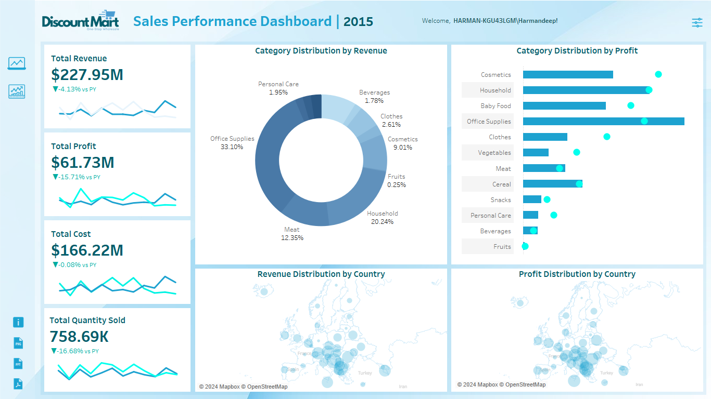
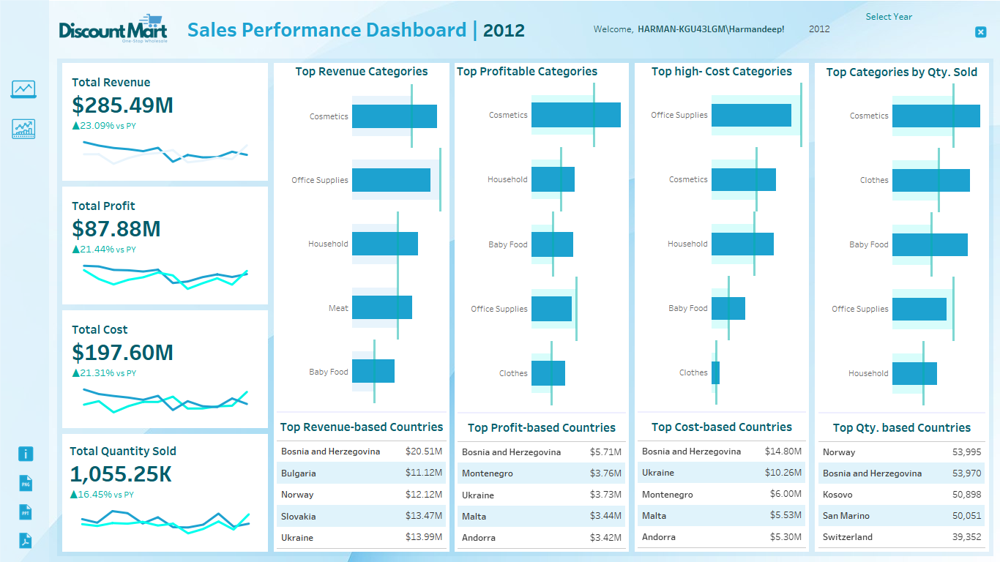

# DiscountMart: Sales Performance and Profitability Insights Dashboard

### 📊 Project Overview
This project focuses on creating a **Sales Performance and Profitability Insights Dashboard** for **DiscountMart** using **Tableau**. The dashboard provides key business insights into DiscountMart’s financial health, including **revenue**, **profit**, **costs**, and **sales performance** across **product categories** and **countries**.

### 📍 Problem Statement
**DiscountMart**, a wholesale company based in Europe, is facing challenges in tracking its sales performance efficiently. The company needs a clear view of **sales trends**, **profitability**, and **cost management** across different product categories and countries. This dashboard helps **business executives** or **stakeholders** get an overview to make **data-driven decisions** to optimize sales, profits, and reduce costs.

### 🎯 Objectives
- **Overview Dashboard**: Provide a high-level snapshot of DiscountMart’s performance, featuring **KPIs** like **total revenue**, **profit**, **costs**, and **sales volume**.
- **Performance Dashboard**: Present detailed insights into top-performing categories, regions, and profitability to guide **marketing** and **sales strategies**.
- Enable **data-driven decision-making** by highlighting areas where **sales performance** can be improved and **costs** can be reduced.

### 📥 Dataset
The dataset used for this project includes:
- Sales transactions data, including:
  - 📅 Date of sale
  - 📦 Product ID
  - 🔢 Quantity sold
  - 💵 Unit price
  - 👤 Customer ID
  - 🌍 Country/region
- The dataset is provided in **CSV format** and has been cleaned and transformed in **Tableau Prep Builder** before visualization in Tableau.

### 📋 Dashboards Overview
- **Overview Dashboard**: The Overview Dashboard provides a comprehensive snapshot of DiscountMart's performance. It will include all the essential **KPIs**, offering a clear and concise view of the company's overall health and performance. Key features of this dashboard are:
  - 💰 **Total Revenue**: Insights into overall revenue with YoY and PY comparisons.
  - 📈 **Total Profit**: Displays total profit with trend lines for the current year and previous year.
  - 💸 **Total Cost**: Visualizes overall costs incurred to deliver orders.
  - 📊 **Total Quantity Sold**: Tracks total quantity of products sold.
  - 📉 **Category Distribution by Revenue and Profit**: Visualizes the distribution of revenue and profit across different product categories.
  - 🌍 **Country Distribution by Revenue and Profit**: Highlights revenue and profit distribution by country.

  - **Performance Dashboard**: The Performance Dashboard focuses on detailed performance metrics, showcasing top categories and other critical data points. It will include:
    - 💵 **Top Revenue Categories and Country**: Product categories with the highest revenue, along with country-specific data.
    - 💡 **Top Profitable Categories and Country**: Categories with the highest profitability, providing insights into profitable regions.
    - 💸 **High-Cost Categories and Country**: Identifies categories with the highest costs, helping optimize cost management strategies.
    - 🏅 **Top Categories by Quantity Sold and Country**: Displays the most sold product categories across different countries.
    
These dashboards together will provide a holistic view of DiscountMart’s performance, enabling **data-driven decision-making** and **strategic planning**.

### 📂 Files in This Repository
- `DiscountMart_Dashboard.twbx` – Tableau workbook with dashboards and visualizations.
- `Europe Sales Records.csv` – Sample data used for this project.

### ⚙️ How to Use
1. **Download Tableau** if you don't already have it (available at [Tableau's website](https://www.tableau.com/)).
2. **Open the Tableau Workbook** (`DiscountMart_Dashboard.twbx`) in Tableau Desktop to explore the visualizations and insights.

### 📈 Visualizations & Insights
This dashboard allows users to:
- **Track Revenue and Profit Trends**: Monitor sales and profit changes over time, including Year-over-Year (YoY) and Previous Year (PY) comparisons.
- **Category-wise Revenue and Profit Distribution**: Understand which product categories are the most profitable.
- **Regional Performance**: Visualize sales performance by country/region to identify high-performing markets and regions that may require more attention.

### 📜 License
This project is licensed under **Creative Commons Zero (CC0)**. This means you are free to use, modify, and share the content (such as the dashboards and data) for any purpose, including commercial use, without needing to ask for permission. You can adapt it, distribute it, or build on it as you like.
